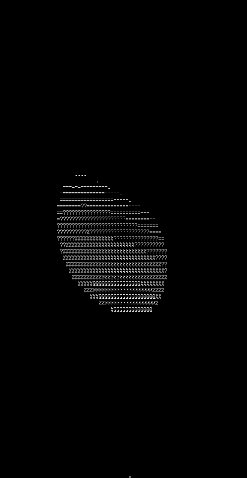

# A Donut Revolution

Source:
https://www.a1k0n.net/2011/07/20/donut-math.html

Implemented with varying lightsource (Lx, Ly), visualized, and cleaned up a bit.



### Build and run

```bash
mkdir -p build && cd build; cmake .. && make && ./donut
```