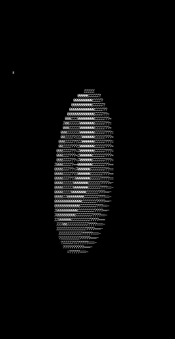

# A Donut Comparison

Source:
https://www.a1k0n.net/2011/07/20/donut-math.html

Implemented with varying lightsource (Lx, Ly),
computed in compile time with C++20 constexpr functions,
visualized with OpenGL. 
Compare startup computation, single threaded run-time and slight multithreading.
C++20 can't compute these huge data structures at compile-time on my computer because it takes too much memory apparently.

### Display comparison: Ascii vs OpenGL
 

### Compute comparisons
 


// TODO compute while running the rendering multithreaded.

### Results for OpenGL
| Processing time [ms] 	| Mean    	|
|----------------------	|---------	|
| run_time             	| ~110000 	|
| run_time_multi       	| ~100000 	|
| startup_time         	| ~10000  	|

Doing the rendering in a separate thread is only slightly faster, since visualizing with opengl only takes about ~1/10 of the time.
The rendering itself should be split into multiple threads.

### Build

```bash
mkdir -p build && cd build; cmake .. && make
```

### Run
./donut --help

### TODO
- Split rendering into multiple threads
- Add raytracing and a mirror to opengl rendering
- Optimize render_frame to reduce amount of operations used to be able to compute more frames during compilation
- Improve compile speed by using Bazel
- (Maybe) Make resolution an argument